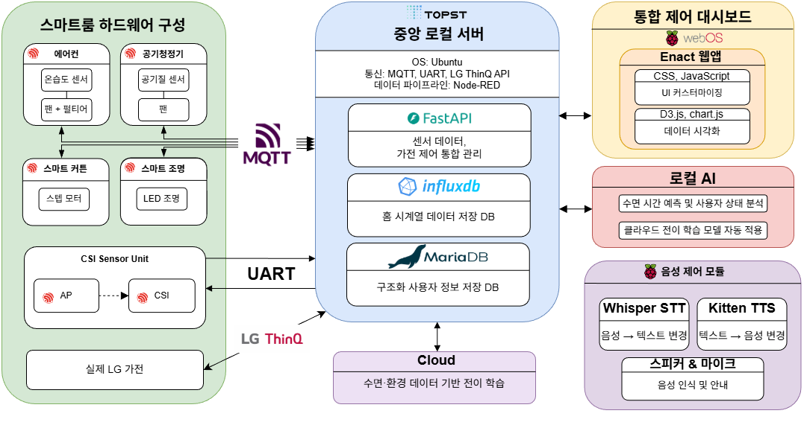
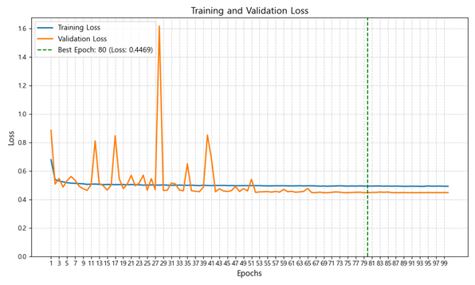
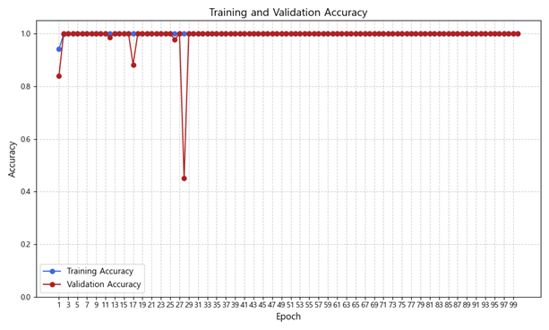

# 💤 SOOM: Sleep Observation & Optimization Module

> 부문: 스마트 가전<br/>팀명: 동방예의지국<br/>개발기간: 2025.07 ~ 2025.10

Wi-Fi Sensing 기반 비접촉 수면 감지 및 자동 환경 제어 시스템

<div align="center">

</div>

---

## 📌 프로젝트 개요 (Overview)

**SOOM(Sleep Observation & Optimization Module)** 은 Wi-Fi CSI(Channel State Information)를 활용해 **비접촉 방식으로 수면 상태를 감지**하고,  
AI 기반 분석 결과에 따라 **조명·커튼·에어컨·공기청정기 등을 자동 제어**하는 스마트 홈 수면 최적화 시스템입니다.

주요 특징:
- **비접촉 수면 감지 (Wi-Fi CSI)**
- **AI 기반 수면 이벤트 분류**
- **스마트 홈 자동 제어 (MQTT / LG ThinQ API 기반)**
- **ESP32-C3/C6 기반 실시간 환경 정보 수집**
- **MariaDB 기반 수면 리포트 시각화**

## 🏗 시스템 아키텍처 (System Architecture)

<div align="center">

</div>

---

## 📡 하드웨어 구성 (Hardware)

| 구성 요소 | 모델 / 사양 | 역할 |
|----------|-------------|------|
| ESP32-C6 (송신기) | MAN16 | Wi-Fi CSI 패킷 송출 |
| ESP32-C6 (수신기) | MAN16 | CSI 수신 및 Gain 보정 |
| TOPST D3-P | Ubuntu 22.04 | 서버 + Node-RED + DB(InfluxDB & MariaDB) |
| Raspberry Pi 4B #1 | Raspberry Pi OS (64-bit) | STT/TTS + 스피커/마이크 음성 제어 모듈  |
| Raspberry Pi 4B #2 | webOS OSE v2.28.0 | webOS(Enact) 기반 통합 제어 대시보드 |
| ESP32-C3 Super Mini (스마트 커튼) | NEMA17 + A4988 | 실내 활동 기반 자동 개폐 |
| ESP32-C3 Super Mini (스마트 조명) | WS2812 | 실내 활동 기반 조도 조절 |
| ESP32-C6 (에어컨) | DHT22 + 펄티어 | 냉방 제어 / 수면 환경 조절 |
| ESP32-C6 (공기청정기) | PMS7003 + MQ135 | 공기질 측정 및 정화 팬 제어 |

---

## 🧠 소프트웨어 구성 (Software)

### ● Embedded (ESP-IDF)
- Platform: ESP32-C3 / ESP32-C6
- Framework: ESP-IDF (5.4.2)
- Language: C (C11)
- OS: FreeRTOS
- Build System: CMake
- Communication: Wi-Fi (Station Mode), MQTT
- Key Libraries & Protocols:
    - `esp-mqtt` (MQTT 통신)
    - `esp-wifi` (Wi-Fi CSI 수집)
    - `esp-sntp` (NTP 시간 동기화)

### ● AI Pipeline
- Platform: TOPST D3-P (Ubuntu 22.04 LTS, Python 3.10)
- Frameworks: NumPy, SciPy, PyWavelets, scikit-learn, PyTorch
- Data Source: ESP32-C6 CSI 수신 데이터 (Amplitude)
- Processing Stages:
    - **CSI Amplitude Extraction**: Raw CSI → 52-Subcarrier amplitude 변환
    - **Wavelet Denoising (Stage 1)**: PyWavelets 기반 저주파 노이즈 제거
    - **PCA Dimensionality Reduction**: 1~3 Principal Component 추출
    - **FFT-based Noise Filtering (Stage 2)**: 고주파 잡음 및 주기성 노이즈 억제
    - **Motion/Sleep State Classification**: 딥러닝 기반 수면 상태 분류
    - **BPM Estimation**: FFT 통한 호흡 주기(breathing rate) 계산
- Outputs:
    - 실시간 수면 상태 (stand / lie / rustle 등)
    - BPM (Breath Per Minute)
    - Node-RED 및 Dashboard로 전송되는 상태값

### ● Backend
- Platform: TOPST D3-P (Ubuntu 22.04 LTS)
- Services: Node-RED, FastAPI, InfluxDB 2.7.12, MariaDB, Mosquitto MQTT
- Language: Python 3.10 / JavaScript (Node.js)
- Data Flow: MQTT → Node-RED → DB(InfluxDB/MariaDB) → API/Dashboard
- Key Roles:
    - **Node-RED**: 실시간 데이터 파이프라인, 자동화 루틴 생성, 디바이스 이벤트 처리
    - **InfluxDB 2.7.12**: Wi-Fi CSI 및 실시간 센싱 데이터 저장 (Time-Series)
    - **MariaDB**: 사용자 정보, 디바이스 설정, 수면 기록 메타데이터 저장 (RDBMS)
    - **FastAPI**: REST API 서버 (대시보드/AI/Node-RED와 통신)
    - **Mosquitto MQTT**: Embedded ↔ Server 간 메시징 브로커
- Communication: MQTT, HTTP/REST, WebSocket

### ● Frontend (webOS Dashboard)
- Platform: Raspberry Pi 4B #2 (webOS OSE)
- Framework: Enact (webOS 공식 UI 프레임워크)
- Language: JavaScript / JSX
- UI Components: Enact UI Components, CSS-in-JS
- Visualization: Chart.js, D3.js
- Key Features:
    - 실시간 수면 상태·센싱 데이터 시각화
    - 스마트 커튼/조명/에어컨/공기청정기 제어 UI
    - 사용자 수면 분석 리포트
    - 자동화 정책 설정 (Bedtime/Wake-up Routine)
- Communication: REST API (FastAPI), WebSocket, MQTT(간접)

### ● Voice Control (STT/TTS)
- Platform: Raspberry Pi 4B #1 (Python 3.10)
- Frameworks: Whisper STT, Kitten TTS, PyAudio
- Hardware: USB 마이크, 스피커
- Processing Flow:
    - **Voice Capture**: 마이크 입력 수집 (16kHz PCM)
    - **Speech-to-Text (STT)**: Whisper 기반 명령어 텍스트 변환
    - **Intent Parsing**: 조명/커튼/에어컨/공기청정기 명령어 해석
    - **Device Control Dispatch**: FastAPI 또는 MQTT를 통한 장치 제어
    - **Text-to-Speech (TTS)**: Kitten TTS로 피드백 음성 생성
- Key Features:
    - “커튼 열어줘”, “조명 꺼”, “에어컨 켜줘” 등 자연어 명령 지원
    - 실시간 명령 처리 (지연 시간 0.8~1.5초)
    - Dashboard/Node-RED와 상태 동기화
- Communication: HTTP/REST(FastAPI), MQTT

---

## 📂 프로젝트 구조 (Repository Structure)

```plaintext
SOOM/
├─ SOOM-FE.dashboard/     # webOS 대시보드 (Enact/React, Vite)
├─ SOOM-BE.platform/      # FastAPI 백엔드 (MariaDB/InfluxDB/MQTT)
├─ SOOM-Voice/            # 온디바이스 음성 파이프라인 (VAD→STT→Intent→TTS)
├─ SOOM-Node-RED/         # Node-RED 플로우 (voice/routine/manual/ThinQ)
├─ SOOM-AI/               # 수면·호흡 분석, 학습/추론, 신호 전처리·증강
├─ SOOM-AI.OnDevice/      # 학습된 모델을 임베디드 환경에 배포 및 실행하기 위한 메인 추론 파이프라인
├─ SOOM-AI.fine_tuning/   # 성능 최적화 및 특정 작업 적응을 위한 미세조정 코드
├─ SOOM-EM.devices/       # ESP32 장치별 펌웨어 (Device/CSI 등)
└─ README.md              # 프로젝트 개요 및 문서
```

---

## 🔧 설치 및 실행 방법 (How to Run)

### 공통 요구 사항
- Node.js 18+ / npm
- Python 3.10+ (가상환경 권장)
- FastAPI, MariaDB, InfluxDB 2.x, Mosquitto(MQTT)
- webOS OSE (RPi4) + ares-cli (IPK 배포용)
- ESP-IDF v5.4.2+ (ESP32-C3/C6 빌드용)

### 1) Backend (SOOM-BE.platform)
```bash
# Step 1
cd SOOM-BE.platform

# 가상환경 생성 및 활성화
python -m venv .venv
# Linux/macOS
source .venv/bin/activate
# Windows
# .venv\Scripts\activate

# 의존성 설치
pip install -r requirements.txt

# FastAPI 실행
uvicorn main:app --host 0.0.0.0 --port 8000

```

```bash
# Step 2
cd SOOM-BE.platform/Mqtt
python3 connect.py

```
> MariaDB / InfluxDB / Mosquitto가 먼저 실행되어 있어야 합니다.

### 2) Frontend (SOOM-FE.dashboard)
```bash
cd SOOM-FE.dashboard

npm install
npm run dev        # 개발 모드
npm run build      # dist 생성

# webOS 배포 (RPi4)
ares-package ./dist && ares-install *.ipk

```

### 3) Voice Pipeline (SOOM-Voice)
```bash
cd SOOM-Voice
pip install -r requirements.txt
python pipeline.py

```

### 4) Node-RED Flows (SOOM-Node-RED)
- Node-RED 실행
- 브라우저 접속 → `http://<server-ip>:1880`
- 메뉴 → **Import**
- 저장소의 `.txt` flow 파일 복사 → 붙여넣기
- **Deploy**

### 5) EM.devices (SOOM-EM.devices)
```bash
idf.py set-target esp32c3    # 또는 esp32c6
idf.py menuconfig
idf.py build flash monitor

```

### 6) AI Pipeline (SOOM-AI.OnDevice)
```bash
cd SOOM-AI.OnDevice
python3 main.py

```
> `csi_saver.py`가 먼저 실행되어 있어야 합니다.

---

## 📊 AI 모델 성능 (Performance)

- **Best Epoch:** 80  
- **Best Validation Loss:** 0.4469  
- **Final Training Accuracy:** 100%  
- **Final Validation Accuracy:** 100%

모델은 Training/Validation Loss가 안정적으로 **0.45~0.5 범위 내에서 수렴**하였으며,  
Accuracy 역시 전반적으로 **0.95~1.0 사이에서 유지**되었습니다.  
중간 구간(20~30 epochs)에서 일부 Validation Loss 스파이크가 존재했지만,  
이는 작은 배치 구성 또는 특정 샘플 영향으로 판단되며 과적합 경향은 나타나지 않았습니다.

결과적으로 본 모델은 **높은 일반화 성능**을 보이며,  
CSI 기반 수면 상태 분류 및 호흡 분석에 실시간 적용이 가능한 수준의 안정성을 확보했습니다.

<table>
<tr>
<td align="center"><b>Training & Validation Loss</b></td>
<td align="center"><b>Training & Validation Accuracy</b></td>
</tr>
<tr>
<td></td>
<td></td>
</tr>
</table>


---

## 🧪 테스트 환경 (Test Environment)
- 일반 가정 환경 (One-bedroom Apartment)
  - 실제 침실 환경에서 Wi-Fi CSI 기반 수면 분석 테스트
  - 조명·커튼·에어컨·공기청정기 자동화 루틴 검증
  - 1인 가정 환경에서 디바이스 동작에 따른 RF 간섭·멀티패스 변화 측정
- TOPST D3-P (Ubuntu 22.04 Server)
- Raspberry Pi 4B (webOS Dashboard / Voice Control)
- Windows 11 + Python 3.10 (AI Pipeline 개발)
- ESP32-C3 / C6 실기기 테스트
- LG 에어컨을 이용한 ThinQ API 연동 테스트
- 2.4GHz Wi-Fi 환경 변동(문 개폐, 이동)과 환경 변화(온도, 이산화탄소 농도)를 포함한 스트레스 테스트 수행
- 실제 수면 기록(4-7시간) 기반 장기 안정성 테스트

---

## 팀원 구성

<div align="center">

| **[원영진 (팀장)](https://github.com/AI-WonYJ)** | **[권나현](https://github.com/KWNahyun)** | **[김지성](https://github.com/akran123)** | **[송채원](https://github.com/chaerishme)** | **[정영인](https://github.com/jyi0226)** |
|:---:|:---:|:---:|:---:|:---:|
|  |  |  |  |  |
| • 하드웨어 및 시스템 아키텍처 설계 <br> • Edge 시스템 구축 <br> • CSI 신호 처리 설계 <br> • 연동 테스트 총괄 | • AI 전처리 파이프라인 설계 <br> • 수면 상태 분류 모델 개발 <br> • PCA·Wavelet 기반 신호 분석 | • 서버·DB 설계 <br> • FastAPI 개발 <br> • InfluxDB/MariaDB 연동 <br> • MQTT 기반 데이터 처리 | • UX/UI 설계 및 디자인 <br> • 데이터 시각화 <br> • 컴포넌트 구조 설계 <br> • webOS 패키징 | • 음성 명령 파이프라인 설계 <br> • STT/TTS 모듈 구성 <br> • Node-RED 자동화 Flow 설계 |
|  <br>  <br>  <br>  |  <br>  <br>  |  <br>  <br>  <br>  |  <br>  <br>  |  <br>  <br>  |


</div>

---

## 라이선스
- 본 프로젝트는 **MIT License**를 따릅니다. 자세한 정보는 모듈별 LICENSE 파일을 참조하세요.
- LG ThinQ는 LG전자의 상표이며, 본 프로젝트는 비공식 예시를 포함합니다.

⸻

© 2025 동방예의지국. All rights reserved.  
Sleep better with SOOM 🌙
