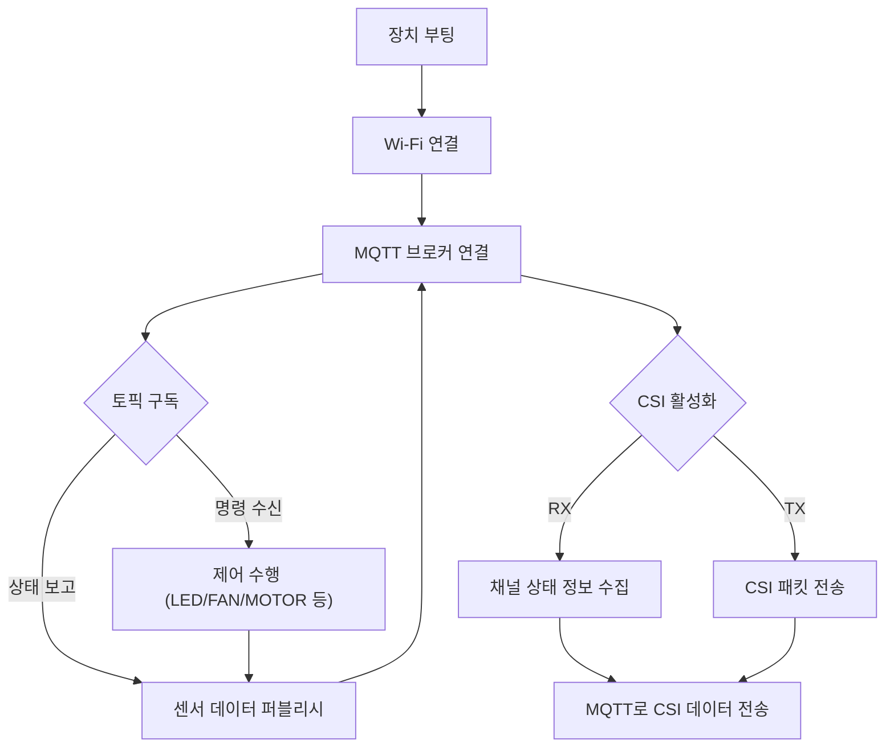
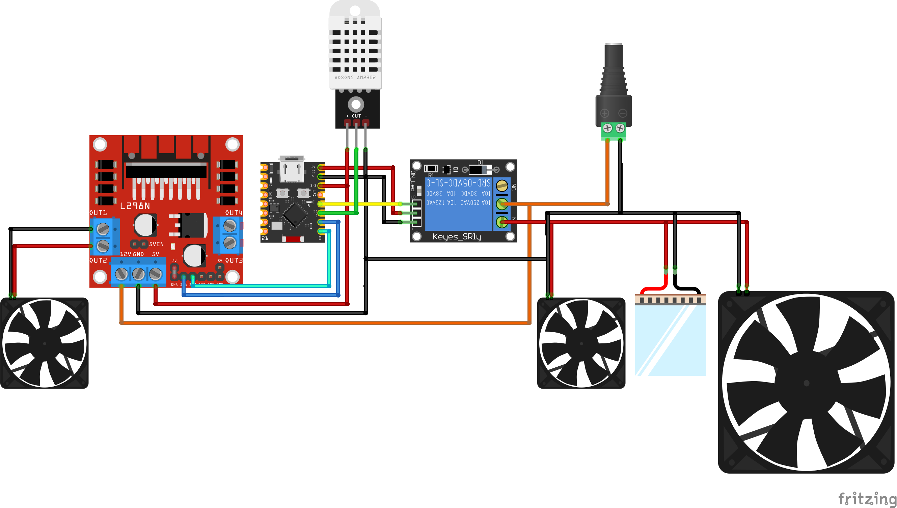
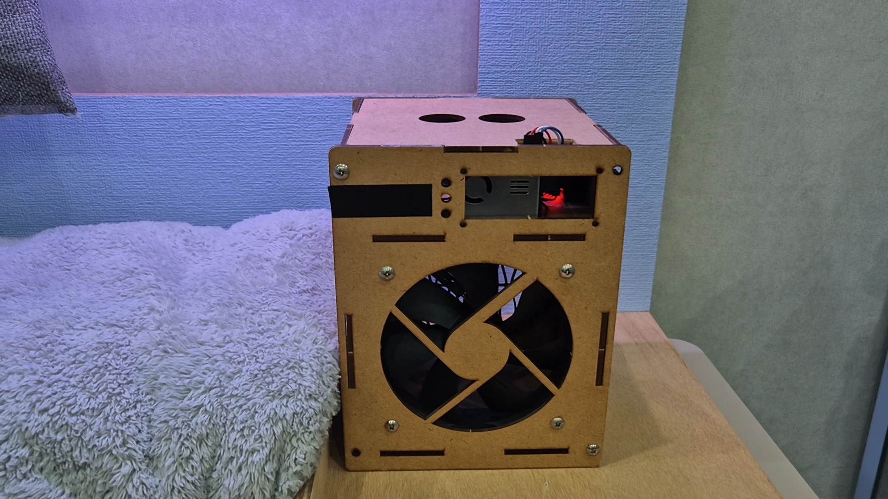
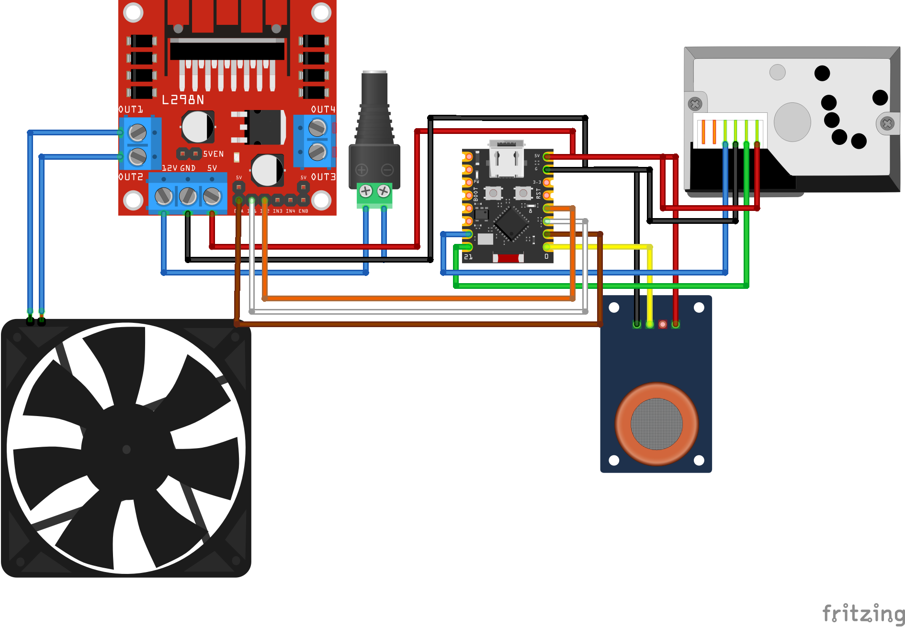
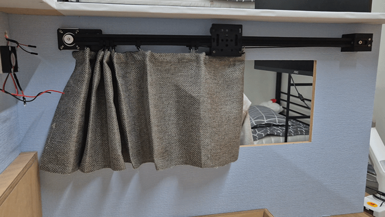
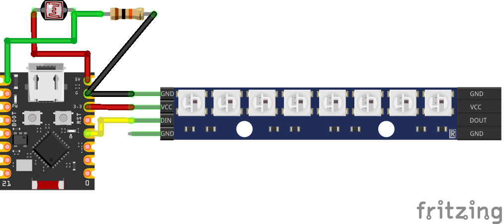

# ⚙️ SOOM-EM.devices

**Wi-Fi / MQTT / CSI 통신을 활용한 스마트 디바이스 통합 모듈**

## 목차

- 프로젝트 진행 기간
- 개요
- 주요 기능
- EM 흐름도 
- 서비스 화면
- 주요 기술
- 아두이노 회로도
- 센서 및 제어

---
## ✨ 개요

이 프로젝트는 ***ESP32 기반의 임베디드 모듈***을 통해
스마트홈·스마트팜 환경의 다양한 디바이스(커튼, 조명, 공기청정기, 냉방기 등)를
***Wi-Fi + MQTT*** 네트워크 상에서 ***독립적이면서도 통합 제어***할 수 있도록 설계되었습니다.

각 모듈은 `menuconfig` 기반의 설정을 통해
Wi-Fi, MQTT, GPIO 등을 개별적으로 구성할 수 있으며,
BLE 또는 CSI 통신을 통해 상호 정보 교환이 가능합니다.

---

## 💡 주요 기능

- Wi-Fi + MQTT 통합 제어: 모든 모듈이 동일한 MQTT 브로커를 통해 통신.
- CSI (Channel State Information): Wi-Fi 채널 상태 정보를 활용해 위치·움직임 인식 가능.
- BLE 기반 초기 설정: BLE를 통해 Wi-Fi, MQTT 설정 정보를 전달 가능.
- 모터 제어 및 자동화: 스테퍼, PWM, 릴레이 기반으로 팬/커튼/펌프 구동.
- Node-RED 연동: MQTT 토픽 기반 시각화 및 자동 순환 제어.
- OTA 확장 구조: 모듈별 독립 OTA 업데이트 가능.

---

## 📊 EM 구조도



---

## 📦 프로젝트 구조
    
| 디렉터리                | 설명                         |
| ------------------- | -------------------------- |
| `air_conditioner/`  | DHT22 + 릴레이 + PWM 모터       |
| `air_purifier/`     | PMS7003 + MQ135 + OLED     |
| `smart_curtain/`    | 스테퍼 커튼                     |
| `smart_light/`      | WS2812 RGB 조명              |
| `wifi_csi_recv/`    | CSI 수신기 (RSSI, 위상, 채널별 신호) |
| `wifi_csi_send/`    | CSI 송신기 (probe beacon 전송기) |
| `csi_saver/`        | 수신 CSI 데이터를 DB에 저장(InfluxDB) |


---

## ⚙️ 빌드 환경

- **ESP-IDF** v5.2 이상  
- **Python 3.10+**
- **보드**: ESP32-C3 / ESP32-C6 시리즈 (Wi-Fi STA 모드)

```bash
idf.py set-target esp32c3
idf.py menuconfig
idf.py build flash monitor
```

---

## 📡 CSI (Channel State Information)

### 📘 개요
CSI는 Wi-Fi 물리층(PHY)에서 ***OFDM 서브캐리어별 진폭·위상 정보***를 캡처하여
무선 채널의 세부 특성을 측정하는 기술입니다.
SOOM-EM.devices는 `wifi_csi_recv/` 와 `wifi_csi_send/` 모듈을 통해
다른 디바이스 간 ***CSI 신호 교환*** 및 데이터 수집이 가능합니다.

---

### 📥 `wifi_csi_recv/` (수신기)

기능:
    - Wi-Fi PHY로부터 CSI 패킷 수집 (`esp_wifi_set_csi_rx_cb()`)
    - JSON 직렬화 후 MQTT 브로커로 전송 (`sensor/csi_data`)
    - 수집 항목: RSSI, subcarrier 값, MAC 주소, timestamp

***출력 예시 (MQTT):***
```json
{
  "mac": "A4:CF:12:34:56:78",
  "rssi": -48,
  "len": 128,
  "timestamp": 4239448,
  "subcarriers": [ 22, 20, 18, ... ]
}
```


***핵심 코드 예시:***
``` c
esp_wifi_set_promiscuous(true);
esp_wifi_set_csi(true);
esp_wifi_set_csi_config(&csi_config);
esp_wifi_set_csi_rx_cb(wifi_csi_rx_cb, NULL);
```

---

### 📤 `wifi_csi_send/` (송신기)

***기능:***
    - 주기적 ***CSI 트리거 프레임(Probe Request)*** 또는 UDP 패킷 전송
    - 수신기(`wifi_csi_recv/`)에서 채널 응답값을 획득
    - 타이머 기반 주기 설정 가능 (menuconfig: `CONFIG_CSI_TX_INTERVAL_MS`)

***핵심 코드 예시:***
```c
wifi_csi_config_t cfg = {
    .lltf_en = true,
    .htltf_en = true,
    .stbc_htltf2_en = true,
    .ltf_merge_en = true,
    .channel_filter_en = true,
    .manu_scale = false,
};
esp_wifi_set_csi_config(&cfg);
esp_wifi_set_csi(true);

while (1) {
    esp_wifi_internal_tx(WIFI_IF_STA, test_packet, len);
    vTaskDelay(pdMS_TO_TICKS(CONFIG_CSI_TX_INTERVAL_MS));
}
```

---

## 🧩 장치별 설명

🌀 `air_conditioner/`



- ***센서***: DHT22 (온습도)
- ***출력***: 릴레이(전원), PWM 모터(속도)
- ***토픽***
    - ***Command***: `sensor/air_conditioner/cmd`
    - ***State***: `sensor/aircondition`

🌫 `air_purifier/`



- ***센서***: PMS7003(먼지), MQ135(가스)
- ***출력***: SSD1306 OLED, 릴레이(팬)
- ***토픽***
    - Command: ```sensor/air_purifier/cmd```
    - State: ```sensor/air_purifier```

🪟 `smart_curtain/`



- ***출력***: A4988/TMC 스테퍼 드라이버
- ***토픽***
    - Command: ```sensor/smart_curtain/cmd```
    - State: ```sensor/smart_curtain```

💡 `smart_light/`



- ***출력***: WS2812 RGB LED 스트립
- ***토픽***
    - Command: ```sensor/smart_light/cmd```
    - State: ```sensor/smart_light```
- ***기능***
    -밝기 스냅: 25/50/75/100%
    - 색온도 프리셋: 휴식 / 독서 / 공부 / 생활

---

## 🧱 Kconfig 설정 예시

`idf.py menuconfig` →
***SOOM Devices Configuration*** 메뉴에서 설정 가능

| 항목              | 설명                      |
| --------------- | ----------------------- |
| Wi-Fi SSID/PASS | 무선 네트워크 정보              |
| MQTT URI        | `mqtt://<broker>:1883`  |
| 각 모듈별 GPIO      | STEP/DIR/EN, 릴레이, LED 등 |
| 퍼블리시 주기         | 센서 또는 상태 보고 주기          |

---

## 🪄 MQTT 메시지 규격 (공통)

| 항목 | 방향              | 예시                                           |
| -- | --------------- | -------------------------------------------- |
| 명령 | Broker → Device | `{"curtain":"on"}` / `{"light_power":"off"}` |
| 상태 | Device → Broker | `{"power":"on","temperature":25.1}`          |

---

## 🧰 개발 표준

- ***코드 컨벤션***: `clang-format` (`Google`, 4 spaces, 100 col)
- ***파일 인코딩***: UTF-8 / LF
- ***빌드***: 모듈별 독립 `CMakeLists.txt`
- ***비밀정보***: `Kconfig.projbuild`로 분리


### 👩‍💻 SOOM EM 담당자: 원영진