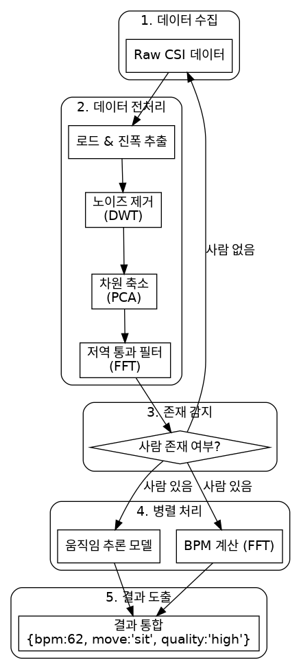

# SOOM-AI
## 전체 파이프라인




## 📂 폴더 구조

```
SOOM-AI/                        # 프로젝트 루트 폴더
├── augmentation/               # 데이터 증강(augmentation) 관련 코드 및 데이터 폴더
│   ├── orig_data/              # 증강할 원본 데이터 (.npy) 가 위치하는 폴더
│   ├── augmented_data/         # 증강된 결과 데이터가 저장되는 폴더
│   ├── augmentation.py         # 원본 데이터를 증강하는 메인 스크립트
│   └── visualize.py            # 증강된 데이터를 시각화하는 스크립트
│
├── model/                        # 모델 학습 및 변환 관련 핵심 코드 폴더
│   ├── train_data/             # 전처리 후 실제 모델 학습에 사용되는 데이터 (.npy) 폴더
│   ├── run.py                    # trainer.py를 실행하기 위한 진입점(entry point) 스크립트
│   ├── trainer.py                # 실제 모델 학습, 평가, 저장 과정을 총괄하는 메인 로직
│   ├── config.py                 # 학습률, 배치 사이즈 등 모든 하이퍼파라미터와 설정을 관리
│   ├── classifier.py             # 모델 구조(Architecture) 정의 (예: 1D-CNN)
│   ├── preprocessed_dataloader.py # 학습용 데이터셋 및 데이터 로더 정의
│   └── convert_to_tflite.py      # 학습된 모델을 ONNX를 거쳐 TFLite로 변환하는 스크립트
│
├── script/                       # 데이터 분석, 초기 테스트 등을 위한 독립 실행형 스크립트 폴더
│   ├── train_data_main.py      # 초기 데이터 전처리 파이프라인 실행 스크립트
│   └── visualize_compare_pca.py # PCA 전후 결과를 비교 시각화하는 분석용 스크립트
│
├── utils/                        # 프로젝트 전반에서 사용되는 유틸리티 함수 폴더
│   ├── extract.py                # Raw CSI 데이터에서 진폭/위상 추출
│   ├── noise_filtering.py        # DWT 기반 노이즈 제거
│   ├── normalize.py              # 신호 정규화 (Z-score 표준화)
│   ├── pca.py                    # PCA를 이용한 서브캐리어 차원 축소
│   ├── fft_filter.py             # FFT 기반 저역 통과 필터
│   ├── kalman_filter.py          # 칼만 필터 기반 노이즈 제거 (대안)
│   ├── breathing.py              # FFT를 이용해 호흡수(BPM) 계산
│   ├── cal_bpm.py                # (breathing.py 와 유사/통합 가능)
│   ├── train_data_parser.py      # 학습 데이터셋 탐색 및 병렬 처리 로직
│   ├── crop.py, load.py          # 데이터 로딩 및 특정 길이로 자르기 등 보조 유틸리티
│   └── visualize_signal.py       # 전처리 단계별 신호 변화를 확인하기 위한 디버깅용 시각화
│
└── requirements.txt              # 프로젝트 실행에 필요한 라이브러리 목록
```